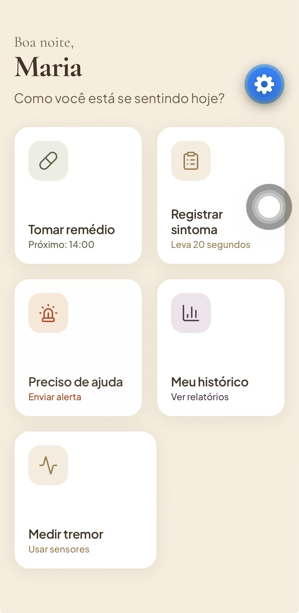
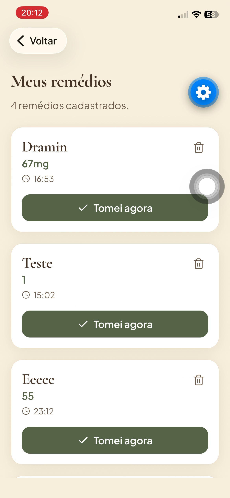
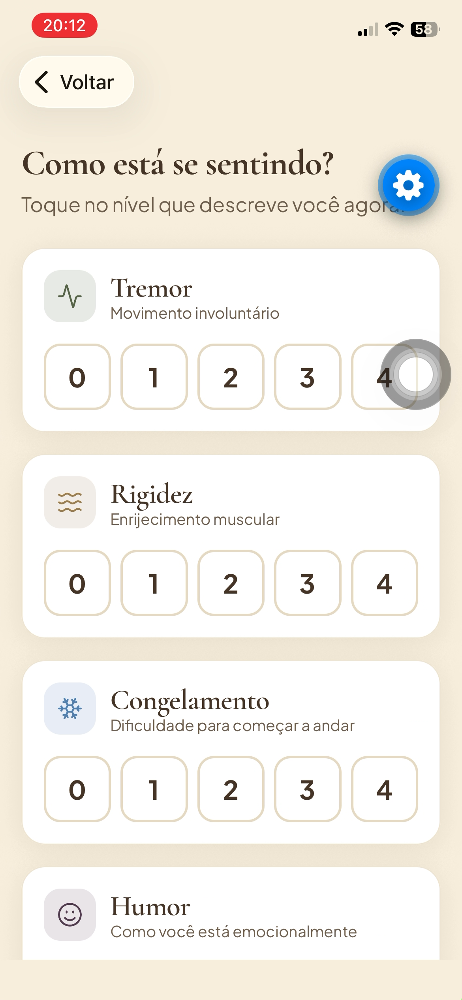
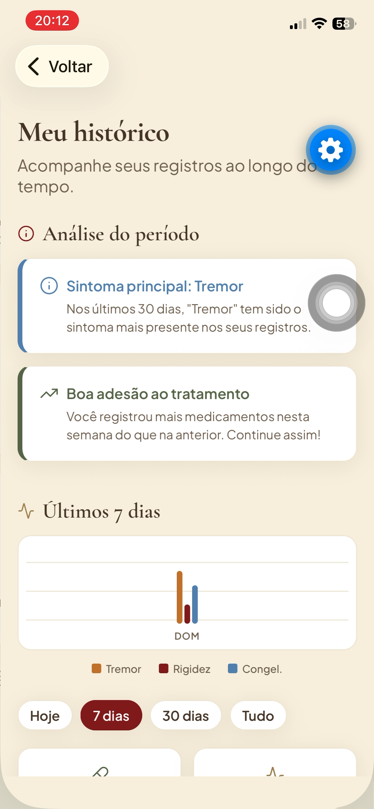
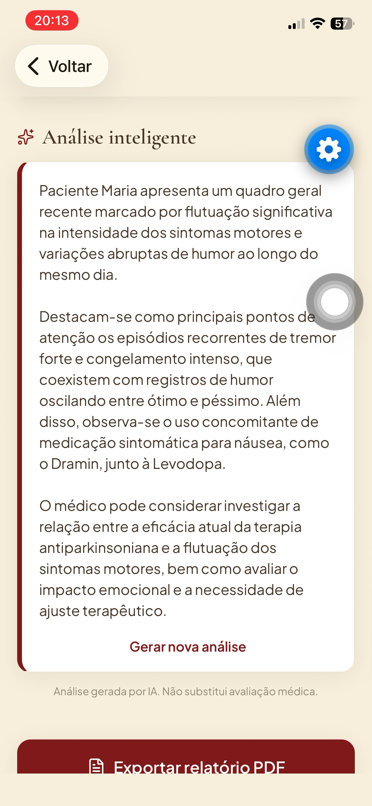
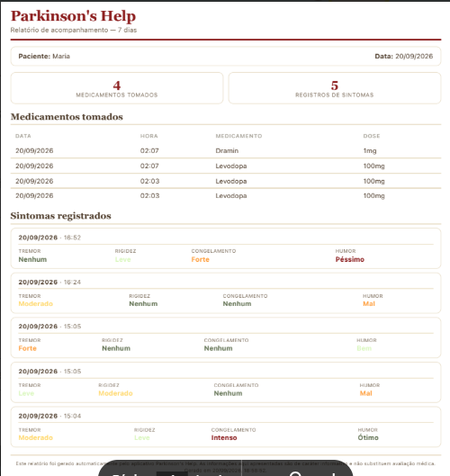

# 🌷 Parkinson'sHelp

> Aplicativo mobile de acessibilidade e apoio ao tratamento da Doença de Parkinson.


---

## 📖 Visão Geral

**Parkinson'sHelp** é um aplicativo mobile desenvolvido para auxiliar pacientes no gerenciamento diário do tratamento da Doença de Parkinson. O projeto nasceu da identificação de uma lacuna no mercado: a ausência de soluções verdadeiramente acessíveis para pessoas com limitações motoras severas.

O aplicativo contempla três atores do processo terapêutico:

- **Paciente** — gestão de medicação, registro de sintomas e autonomia no dia a dia
- **Cuidador** — suporte em emergências com localização em tempo real
- **Profissional de saúde** — acesso a relatórios clínicos objetivos e organizados

---

## 🎯 Problema e Solução

### O Problema

A Doença de Parkinson impõe desafios motores e cognitivos que tornam o uso de aplicativos convencionais uma tarefa difícil ou inviável. Interfaces padrão exigem toques precisos, gestos complexos e digitação — atividades que pacientes com tremor de repouso, rigidez muscular ou bradicinesia realizam com grande dificuldade.

Além disso, o controle rigoroso dos horários de medicação é essencial para evitar o "efeito off" — período em que os sintomas motores retornam com intensidade. Médicos e cuidadores frequentemente dependem do relato de memória dos pacientes, gerando dados incompletos ou imprecisos.

### A Solução

O Parkinson'sHelp resolve esse problema com uma abordagem de **acessibilidade extrema**, projetada desde o início para quem tem limitações motoras:

- Botões com dimensão mínima de **60dp** (recomendação WCAG)
- Tipografia que respeita a **configuração de fonte do sistema operacional**
- **Curva sublinear de escala** com trava de segurança para preservar o layout
- **Zero digitação** desnecessária (botões de toque rápido)
- Feedback **visual, sonoro e por vibração** em cada interação

---

## ✨ Funcionalidades

### 👤 Cadastro de usuário
- Identificação do paciente na primeira abertura
- Armazenamento local no próprio dispositivo
- Saudação personalizada na tela principal

### 💊 Gestão de medicamentos
- Cadastro com nome, dose e múltiplos horários
- Botões rápidos para horários comuns (08:00, 12:00, 14:00, 18:00, 20:00)
- Entrada alternativa com auto-formatação (digitar "830" → "08:30")
- Botão **"Tomei agora"** com registro automático de data e hora

### 🔔 Notificações de medicação
- Alerta agendado para cada horário de cada medicamento
- Funciona mesmo com o aplicativo fechado
- Notificação com som, vibração e alta prioridade

### 📝 Registro de sintomas
- Avaliação de quatro sintomas: **tremor, rigidez, congelamento e humor**
- Escala visual de 0 a 4 com progressão de cores
- Interface baseada em toques simples, sem digitação

### 📊 Histórico e análise
- Filtros de período (Hoje, 7 dias, 30 dias, Tudo)
- Gráfico de barras agrupadas dos últimos 7 dias
- Insights automáticos de tendências e adesão ao tratamento

### 🤖 Inteligência Artificial
- Integração com o modelo **Gemini (Google)** para geração de resumo clínico
- Análise de dados reais do paciente em linguagem natural
- **Retry automático** com 3 tentativas em caso de falha
- **Degradação amigável**: se a IA falhar, insights locais permanecem

### 📄 Relatório em PDF
- Layout profissional otimizado
- Cabeçalho com identificação e período
- Tabelas e cards de sintomas com indicadores coloridos
- Compartilhamento via WhatsApp, e-mail, AirDrop ou arquivos

### 🚨 Botão SOS / Emergência
- Contato de emergência cadastrado
- Captura de localização via GPS
- SMS pré-preenchido com mensagem, data, hora e link do Google Maps

### 📈 Sensores de movimento
- Medição de tremor usando o **acelerômetro nativo** do smartphone
- Sessão de 20 segundos com gráfico em tempo real
- Classificação em 5 níveis (Nenhum → Intenso)

### ♿ Acessibilidade
- Botões grandes, tipografia adaptável, alto contraste
- Escala dinâmica com curva sublinear
- Tela dedicada de ajuste fino
- Feedback háptico em todos os toques

---

## 📱 Telas do Aplicativo

### Tela Principal


### Medicamentos


### Registro de Sintomas


### Histórico com Análise


### Análise por IA


### Relatório em PDF


---

## 🛠️ Tecnologias Utilizadas

### Framework e linguagem
- **React Native** — desenvolvimento mobile multiplataforma
- **Expo SDK 57** — plataforma de desenvolvimento e acesso a recursos nativos
- **JavaScript / JSX** — linguagem principal

### Interface e navegação
- **React Navigation** — navegação entre telas
- **Lucide React Native** — biblioteca de ícones vetoriais
- **React Native SVG** — renderização vetorial

### Tipografia e design
- **Plus Jakarta Sans** — fonte sem serifa (interface)
- **Cormorant Garamond** — fonte serifada (títulos)
- **Sistema de design centralizado** em `tema.js`

### Armazenamento
- **AsyncStorage** — persistência local
- **Arquitetura em camadas** para migração futura à nuvem

### Recursos nativos
- `expo-notifications` — notificações agendadas
- `expo-location` — GPS para SOS
- `expo-sensors` — acelerômetro
- `expo-haptics` — feedback tátil
- `expo-print` / `expo-sharing` — geração e envio de PDF

### Inteligência Artificial
- **Google Gemini API** (`gemini-3.5-flash-lite`)
- Variáveis de ambiente (`.env`) para segurança da chave
- Retry com backoff exponencial

---

## 🏆 Diferenciais

1. **Propósito real com público específico** — projeto concebido desde o início para pessoas com Doença de Parkinson, não adaptado depois.

2. **Acessibilidade projetada, não adaptada** — princípio de design desde a primeira tela.

3. **IA aplicada à saúde de forma ética** — gera resumos clínicos; não faz diagnóstico nem substitui avaliação médica.

4. **Sensores nativos sem hardware adicional** — democratiza acesso à tecnologia assistiva.

5. **Ecossistema completo de cuidado** — atende paciente, cuidador e médico em uma única solução.

---

## 🚀 Como Executar o Projeto

### Pré-requisitos
- **Node.js** (versão LTS) — [baixar aqui](https://nodejs.org)
- **Expo Go** no celular — disponível na App Store e Play Store
- Celular e computador na **mesma rede Wi-Fi**

### Passo a passo

```bash
# 1. Clonar o repositório
git clone https://github.com/fernandajuiz-lgtm/fernanda-parkinsons.git

# 2. Entrar na pasta
cd fernanda-parkinsons

# 3. Instalar dependências
npm install

# 4. Configurar variáveis de ambiente (criar arquivo .env)
# EXPO_PUBLIC_GEMINI_KEY=sua_chave_aqui

# 5. Iniciar o projeto
npx expo start